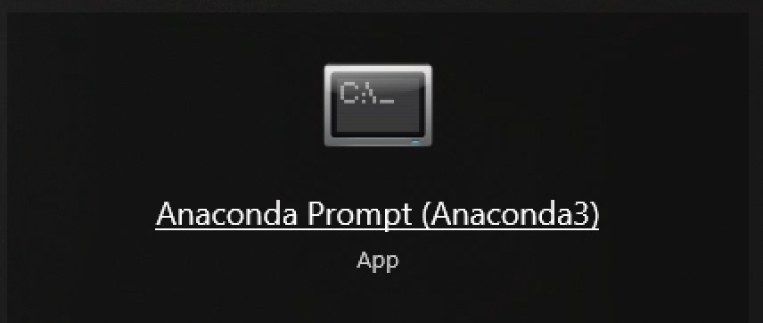
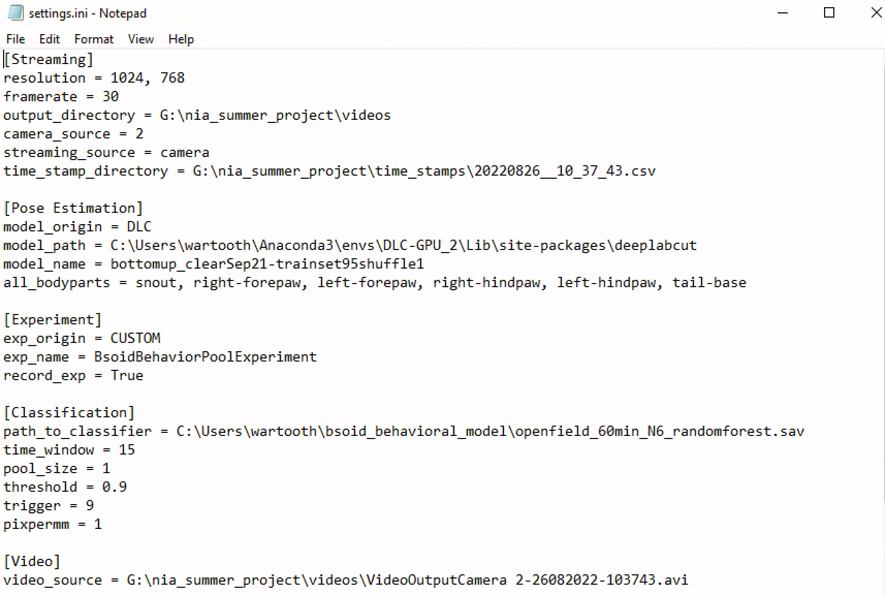

# realtime-stim-protocol
protocol for new Yttri-ers doing closed-loop stim

### open anaconda prompt and set up conda environment (on jimi)

`conda activate DLC-GPU`

### navigate to DeepLabStream directory
`cd DeepLabStream`

### run DeepLabStream UI
`python app.py`

(optional) if you want to adjust settings, open settings.ini in DeepLabStream folder

### open camera (make sure it's not opened up elsewhere like in OBS)
click on start stream

### kick off a neural net for predicting pose in real-time
click on start analysis

### kick off a B-SOiD behavioral classifier based on pose in real-time
click on start experiment

